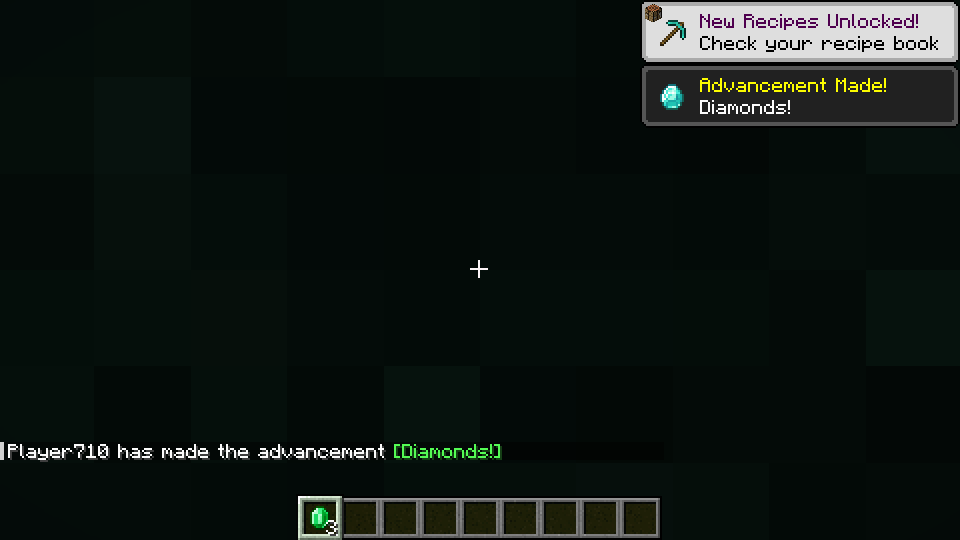

# Beyond Minecraft

### The world is not empty. Something is looking back.

**Minecraft Java 1.21.1 · Fabric · Java 21 · 0.2.0-alpha**

A standalone, shader-driven playable slice: a colossal **reachable** singularity above the
Overworld, a person-shaped Presence standing in the sky, twelve procedural realms with their own
materials, tidal spaghettification, tornado gravity, time tunnels, a Tear into a bubble universe,
an endless white maze, a Menger-sponge fractal world, twelve reality-switching visors and the
Umbrella Effect. It does not replace Enter the Sift or the Lumital browser app elsewhere in this
repository.

**Build and smoke-test status lives in [docs/BUILD_STATUS.md](docs/BUILD_STATUS.md).** Download the
installable alpha from [releases/](releases/) (the checked-in JAR is the last full green snapshot),
then follow [INSTALL.md](INSTALL.md). Both client and server need this mod and Fabric API. This is a
bounded alpha, not production-certified: use a disposable, backed-up world.



## What this build actually does

### The sky well is real, and you can fly to it

- A persistent **prime singularity** floats **232 blocks above spawn**, roughly 760 blocks out:
  inside the build limit, so it is a place you can reach, not a backdrop.
- Its lens genuinely **warps the rendered scene** — terrain, water, cloud and other anomalies bend
  around the photon sphere, because the post-processor integrates a Schwarzschild-style null orbit
  per pixel against the real depth buffer. It is not a picture in the sky.
- Fly in: cloud and rod particles thicken into a **nebula shell** you can pass through. Walk in, and
  the horizon takes you to the bubble hub; look back the other way and the Overworld is visibly
  bent behind you.
- It **grows** by feeding: every mob, item or torn block it swallows increases its radius, up to the
  configured cap.

### Spaghettification, tornado gravity, and things with mass

- Gravity pulls **every** living entity, item and falling block — not just the player. Anything that
  reaches the horizon is consumed and the well swells.
- Entities inside a tidal reach are drawn **stretched along the pull axis** and thinned out, in the
  entity's own local frame (client-side render transform; server physics and collisions are
  untouched). Mobs, animals and items all become noodles.
- A feeding well runs a **tornado**: bounded numbers of real blocks and whole tree columns are
  detached as falling blocks, spiral, and are eaten. Never bedrock, barriers, command blocks,
  containers or fluids; the whole thing is budgeted per tick and per well.
- Six anomaly kinds exist: membrane, singularity, **tear**, **wormhole**, **quasar** (which pushes
  instead of pulling) and the world-owned **prime** well. Each is a different shader treatment and a
  different gameplay object.

### The Tear, the bubble cluster and the abyss

- **Tear the fabric** with the Reality Tear item (`R` key or item): a colossal detonation, a
  pressure-wave sound, a particle shockwave, and then the rift opens in the sky with its own
  animation — layered lightning, glass bubbles, a torn silhouette and a rag of reality caught in it.
- Step through: **no loading screen**. Vanilla's terrain/level/loading overlays are dismissed while
  Beyond is moving you or while you stand in a Beyond space, and the post-processor's warp covers
  the swap. You simply keep walking.
- Beyond the tear is the **bubble hub**: a cracked white-and-black puzzle plate floating in a void,
  ringed by glass shells containing lit pocket worlds you can fly into and out of, with a genuine
  **black abyss at the centre**.
- Fall into the abyss and the world turns into **the endless white maze**: pure white brick, black
  seam lines, layered floors and walls as far as the world height allows, with gaps that drop you
  into the layer below. Dig down, and it keeps going.
- The **fractal hollow** is a Menger-sponge world threaded with a helical staircase: recursive
  chambers, tunnels that feed into more tunnels, and the same structure repeating deeper and deeper.

### Twelve realms, not twelve colours

- **12 realms**: Lucent Canopy, Violet Fold, Cinder Cathedral, Boreal Memory, Rose Continuum,
  Pelagic Dream, Obsidian Hymn, Ochre Archive, Vesper Between, Endless Labyrinth, Fractal Hollow,
  Temporal Reach. Nine are compiled noise terrain with their own noise settings, biome, fog and sky
  colour; three are drawn by **custom chunk generators** (bubble hub, white maze, fractal sponge)
  that are pure closed-form functions of the coordinates — infinite in every direction, no storage
  growth, identical for every player.
- Each realm owns **five materials** — stratum, surface, crystal (animated, emissive), flora, core —
  with its own procedurally painted texture family, block properties, recipes and echo item. They are
  not recolours of one another.
- Each biome carries its own spawner table of the mod's creature, the **Realm Critter**: four
  families (canopy, fold, cinder, void) that differ in **body size** (0.75× to 1.6×), skin, family
  name and behaviour — grazers, stalkers, runners and huge void drifters that watch you and flee
  rather than force a fight.

### Twelve realities behind one pair of glasses

- The **Radiate Reality Glasses** (head slot) switch the whole screen, not a tint: Lucid, Aurora,
  Prismatic, Negative Space, Living Membrane, Echo Memory, **Neon City** (colossal city blocks and
  traffic light streaks), **Backrooms**, **Poolrooms**, **Cel Animation**, **Eighties CRT** and
  **Chromatic Fold**. Press **V** to cycle, or use the Field Guide.
- The same program also drives the era treatments, the tunnel overlay and the rift, so the visor
  and the world always agree about which reality you are standing in.

### Unlimited scale

- The **Scale Prism** walks a ladder from **1/1024×** — a speck that fits between two blocks of air —
  to **4096×**, which is far taller than the build limit, with 14 rungs in between
  (1/256, 1/64, 1/16, ¼, ½, 1, 2, 8, 32, 128, 512, 2048 …). Nothing caps growth at tree size or
  shrinking at block size.
- Growing is refused when the new body would intersect terrain (a full volume test up to 16×, a
  sampled occupancy scan above that, because a 4096× body is millions of blocks).
- Sub-quarter-scale bodies get a **per-tick travel cap** proportional to their own height, so a
  1/1024× player cannot tunnel through a block in one gravity step.

### The Umbrella Effect

- Every branch you displace through increments your **era**, and the reality you come back to is
  rewritten around your arrival point: gigantic living trees, a frozen neon eighties street grid,
  a primeval jungle, alien-corrupted ground, veined rock, a bleached white branch, or an already
  burned one.
- Rewrites are budgeted, deterministic (they come from the journey's era seed, so the same branch
  rewrites the same way), and refuse to touch bedrock, barriers, containers, fluids or block
  entities.
- `/beyond era` shows where you are; `/beyond era 3` sets the branch directly.

### The Presence in the sky

- The Overworld figure reads as a **person**: a head, shoulders, an arm reaching up through the
  cloud deck, and an eye that opens and tracks you. It is animated, anchored to a real world
  position, and it behaves as a dynamic skybox behind the actual terrain rather than a fixed decal.
- It never attacks and never moves the player. The first-join encounter dissolves into falling code.

### Sound

- The in-between spaces carry their own soundscape assembled from vanilla audio retuned far below
  its normal pitch: a **soft hum** as the dominant layer, a **very quiet vacuum**, and
  whisper-like arrivals that never resolve into words. Approaching a colossal well adds a slowly
  rising rumble. Everything is gated by the Ambience toggle.

## Install / build

Use a **Fabric 1.21.1** installation with **Java 21** and **Fabric API 0.102.1+1.21.1**. Fabric
Loader must be at least 0.16.9.

```sh
cd beyond-minecraft
./gradlew build             # Windows: gradlew.bat build
```

The installable file is `build/libs/beyond-minecraft-0.1.0-alpha.jar`; put it in the client's `mods`
directory (and the server's). **Do not install the `-sources.jar`.** No external shader pack is
required.

### Renderer compatibility and honest limits

- Written for the **vanilla 1.21.1 OpenGL renderer**. Rendering is isolated to the client source set
  and consumes one scratch framebuffer; it reads vanilla depth and never writes it.
- The compositor runs in `WorldRenderEvents.LAST`, after world rendering and before the hand clears
  world depth, so real foreground geometry stays in front of the effect. The last verified native
  fixture measured a zero-channel difference across 20 foreground samples.
- A supported Iris API reporting an active shader pack suspends Beyond's effects instead of fighting
  over depth conventions. Sodium, macOS and real GPU drivers still need their own passes.
- **Portal vistas are procedural, not live renders of the destination world.** The rift shows a
  seeded, styled, parallaxed vista of the realm behind it — the real chunks load when you cross. A
  genuinely recursive Immersive-Portals-style live render is not in this build, and neither are
  photoreal textures: the city, Poolrooms and Backrooms realities are GLSL treatments with geometric
  structure, not scanned photography.
- The Menger sponge recurses three levels and repeats forever in extent; "a thousand levels" is not
  what the code does. The abyss, the maze and the fractal are world-height bounded, not
  mathematically unbounded.
- No target-GPU FPS claim is made: CI runs software OpenGL (Mesa/Xvfb) with a reduced ray budget.

## Controls

| Key | Action |
|---|---|
| **B** | Field Guide (also by using the guide item) |
| **V** | Next reality through the glasses |
| **O** | Emergency toggle for all Beyond visuals |
| **G** / **H** | Grow / shrink with the Scale Prism |
| **R** | Tear the fabric |

## Commands

| Command | Permission | Purpose |
|---|---|---|
| `/beyond` | everyone | Help |
| `/beyond where` | everyone | Dimension, inventory scope and era |
| `/beyond return` | everyone | Escape a Beyond space without an item |
| `/beyond kit` | operator | All six tools |
| `/beyond rift` · `singularity` · `tear` · `wormhole` · `quasar` | operator | Open a specific anomaly |
| `/beyond realm 0` … `11` | operator | Visit a realm, the hub, the maze or the fractal |
| `/beyond scale`, `grow`, `shrink`, `0.0009…4096` | operator | Arbitrary scale |
| `/beyond era [0…64]` | operator | Show or set the Umbrella branch |
| `/beyond well` | operator | Report the sky well's position, radius and feed count |
| `/beyond witness` | operator | Replay the encounter |
| `/beyond clear` | operator | Remove this world's temporary anomalies |

## Safety model

- Default limits: 12 anomalies per world, 3 per player, 50-second lifetime for transient anomalies,
  24-block influence radius, 0.85 blocks/tick velocity cap, 4000-block tornado budget, 900 torn
  blocks and 9000 rewritten blocks per Umbrella job. Every value is clamped when the config loads.
- No client packet can request spawn coordinates, dimensions, scale or eras. Snapshots are
  server-authored and validated on both encode and decode.
- Tornado and Umbrella rewrites never touch bedrock, barriers, command/structure blocks, block
  entities or fluids, and never remove unbreakable blocks.
- Gravity pulls the creator among players; the sky well's own pull is a separate flag
  (`primePullsPlayers`). Creative flight resists it.
- Realm inventories: first entry into a space clones the live inventory once, later visits restore
  that space's own snapshot, and root reality keeps its own. Vault data lives in the same playerdata
  NBT as vanilla's live inventory. This is deliberate isolation, **not** anti-duplication protection.
- Beyond dimensions keep vanilla bed/anchor restrictions: beds and respawn anchors can explode.
  Use `/beyond return`.
- Back up the whole world, especially `playerdata`, before changing seeds, realm counts or versions.

Settings live in `config/beyond-visuals.json` (client) and `config/beyond-server.json` (server).

## Procedural authoring

```sh
python3 tools/generate_multiverse.py                       # default 12 realms, seed 84921603
python3 tools/generate_multiverse.py --check               # byte-for-byte reproducibility gate
python3 tools/generate_multiverse.py --seed 1234 --realms 32
python3 tools/validate.py                                  # resource, shader, mixin contracts
python3 tools/lint_shader.py                               # structural GLSL check
python3 tools/check_shaders.py                             # real glslangValidator compile + link
python3 -m unittest discover -s tools -p 'test_*.py'
```

Minecraft freezes block/item/dimension registries at startup, so the catalog is compiled **before**
the build and the Java initializer registers exactly that catalog: 12 realms produce 60 blocks, 78
items, animated crystal metadata, per-realm noise settings, biomes, features and spawners — 530
generated resources, all reproducible from one seed. Echo realms beyond twelve reuse the palette
ladder with shifted hues, and the cap is 32. Runtime world generation, in contrast, is unbounded:
the realm generators are coordinate functions, so there is no "edge of the map" inside a realm.

## Verification

```sh
python3 tools/validate.py
python3 tools/lint_shader.py
python3 tools/check_shaders.py
./gradlew test build
BEYOND_SMOKE=1 ./gradlew runServer --args=nogui
BEYOND_CLIENT_SMOKE=1 xvfb-run -a ./gradlew runClient
```

The CI harnesses run in disposable fixtures (`beyond-ci`, an isolated copied world) and are never
active in normal installations. The client harness asserts, against real objects: scale extremes are
reachable and reversible, the sky well exists and reaches the client as a persistent node, the lens
measurably changes the scene, spaghettification is actually applied to a rendered entity, a tear
leads to the bubble hub and from there to the fractal hollow and the white maze, a wormhole corridor
arms and tears itself down without leaving barriers, the Umbrella Effect really rewrites the world
around you, and native foreground occlusion still has zero drift with effects on. Screenshots from
the run are uploaded as CI artifacts.

See [architecture](docs/ARCHITECTURE.md), [verification record](docs/BUILD_STATUS.md) and the
[manual test matrix](docs/TEST_PLAN.md). Original code and generated art: Apache-2.0. Minecraft is a
Mojang/Microsoft product; this is an unofficial mod.
