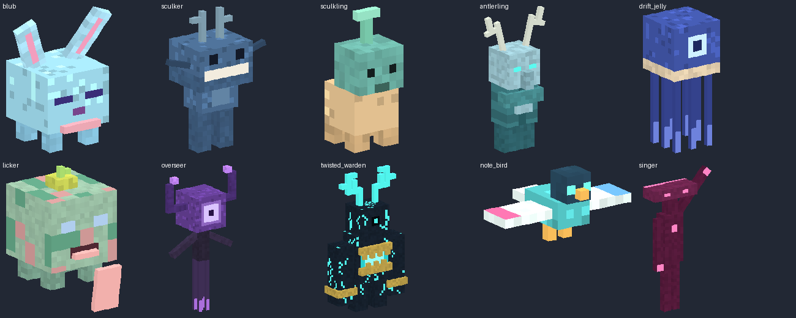

# SIFT OVERHAUL — Enter the Sift
### Six notes. One threshold. Everything lost eventually settles here.

**Fabric mod · version 0.36.0-alpha · Minecraft Java 26.3 · Java 25**

> **Build status:** Offline JSON/resource validation and the data-contract tests pass. The GitHub Actions workflow is the authoritative compiler and artifact build; see [BUILD_STATUS.md](docs/BUILD_STATUS.md) for its current result. In-game rendering and generation still need a client playtest; use a disposable world first.

## 0.25.0-alpha — Sift Overhaul

- The Sift uses its own **Flow / Thrive / Endure** clock. Night-only rifts use the local world clock or Endure inside the Sift.
- Rift openings are a shader plane: stepped silhouette, symmetrical outline, frosted destination, hollow border fragments. Birth is a white disc, then a pulsing seed, then a centre-out assembly. Energy motes rise and flatten.
- Ichor aquifers are dry. Tiny rainbow pools/springs are sparse, and the still/flow/overlay textures are symmetrically animated.
- Boneyard is displayed as **Canopy**, with large visible bone-block skull, tusk and ribcage features; mountains are scaled down.
- **Jelly Lands** adds blue fog/sky, pink turf and grass, pale trees, and frequent Blub groups.
- A cyan Agency Portal-style return rift is present in the Sift arrival plaza.

This is a separate Minecraft project. The existing Lumital React/Three.js app at the repository root is preserved and is **not** the mod.

## What is implemented in source

| Feature | Alpha implementation |
|---|---|
| **The Sift** | Registered data-driven dimension with normal-scale caverns/land gaps, sparse tiny Ichor features, per-biome fog, soul particles and an independent Flow/Thrive/Endure clock. |
| **Carapace** | Bone-coloured surfaces, generated surface ribcages, buried fossils and skeletons. |
| **Singer Meadow** | Teal moss, soul-salt outcrops, and occasional Blubs. |
| **Canopy** | The compatible `boneyard` registry ID, displayed as Canopy; rare giant bone-block skulls, tusks and ribcages. |
| **Jelly Lands** | Dense blue fog/sky, pink turf and grass, pale trees and frequent Blub groups. |
| **Saltwound Expanse** | Salt flats and luminous crystal columns. This third name is a provisional addition; the brief named only two biomes. |
| **Ancient-city ritual** | Six distinct note blocks on coloured wool: **red → magenta → pink → cyan → blue → purple**. An intact reinforced-deepslate frame nearby is required. The same mechanism works with a constructed frame in the Overworld. Six colour-matched full-bright note rims appear on input and on the Singer’s replies. |
| **The Singer** | Original block-display figure rises for four seconds, answers six notes at their recorded positions, and opens a flickering threshold after eleven seconds. It is an animated display rig, not a registered custom mob. |
| **Ichor** | Registered source/flowing fluid and bucket; original animated rainbow textures; contact damages health and drains souls once per second. No infinite-source conversion. |
| **Souls** | Persistent per-player score, initially 20, capped at 100. Ichor drains 3; depleted souls cause a short wither effect. Standing on soul salt slowly replenishes souls in the Sift. |
| **Rift gauntlet** | Punch a block/entity, or right-click, to tear a short-lived rift ahead of you. Costs 10 souls; 3-second cooldown. The target must be air. Night only: outside the Sift the local day cycle must be between 13000 and 22999, inside the Sift the tide must be Endure. |
| **Wandering rifts** | Night-gated encounters across supported dimensions. One quad, drawn by `rift.fsh`: stepped opening, frosted destination, wavy symmetrical outline, faint daytime border frames, 100-tick assembly. |
| **Riftcallers** | Tagged vanilla evokers with a ground-strike particle/sound sequence that creates rifts. No terrain griefing. Not a separately registered illager type. |
| **Soul potion** | A 32-tick drink adds 40 souls and grants 30 seconds of invisibility and slow falling, with soul particles. No spectator mode, flight or wall-phasing. Nearby-player haunting is optional. |
| **Jelly Bunny / Blub** | Low original cube-display body, ears and red eyes; an invisible vanilla rabbit supplies health. Scripted ground-following motion, not full custom navigation or a new registered entity type. |
| **Cinematic look** | Native Java Sift sky, biome fog, rifts and portal. The bundled `Dungeons-II-Overworld-0.15.zip` is optional, Overworld-only and off by default. |

### Important alpha limits

- **Not a one-to-one recreation.** The latest fifteen Minecraft-style screenshots are now the primary reference, superseding the earlier sci-fi images inside the repository ZIP. The source follows their cyan/rose palette and two portal families; authored ruins, giant cyan trees, larger spirit creatures and exact lighting/geometry are still absent.
- Biomes currently use large checkerboard regions over continuous noise terrain, not a custom climate distribution.
- Rift arrival points are shared **origin-based surface landings**, not geographically linked exits: a rift lands the player on the local surface at x=0,z=0 and raises a return gate beside them. This is a safe-testing provision, not finished exploration balancing.
- Arrivals require clear air at y=64 and the origin chunk to be loaded before travel is allowed. The 4 chunks around the origin in each of the 4 dimensions are force-loaded to make those landings available. This is **16 forced chunks total**; see cleanup below.
- Return coordinates are persistent, per-player and block-precision. Nested rifts preserve the first origin until returning. Death clears the saved return. If the original location is altered while away, return safety is not guaranteed—keep an operator rescue command available.
- Rift and ritual timers pause in unloaded chunks; no permanent force-loading of ancient cities or encounters.
- The built-in assets work without Iris; **the optional post-process shader requires a compatible Iris installation and manual selection**. Its sky is procedural, not a literal cubemap. It is not a renderer replacement, shadow mapper, ray tracer or true volumetric renderer. Full-bright note displays do not cast coloured light onto terrain. It has not been GPU-tested.
- Fluid rendering, worldgen codecs, current-version command syntax, multiplayer behavior and the Java bindings still need an actual Minecraft 26.3 build/runtime pass. Static validation cannot establish those.

## Build

Install **JDK 25**, then:

```sh
cd fabric-mod
./gradlew build
# Windows: gradlew.bat build
```

The Gradle wrapper is included. It downloads Gradle 9.7.1 and the dependencies. Versions follow the current official Fabric example:

- Minecraft `26.3`
- Fabric Loader `0.19.5`
- Fabric API `0.161.0+26.3`
- Fabric Loom `1.18-SNAPSHOT` (upstream currently uses a snapshot; resolution needs internet)

After a successful build, install `build/libs/sift-overhaul-0.25.0-alpha.jar` in a **Fabric 26.3** instance's `mods` folder alongside Fabric API. **Do not install the `-sources.jar` or the source ZIP.** Both client and server need the mod because it registers blocks, items and fluids. Restart Minecraft when changing dimensions/worldgen data.

A GitHub Actions workflow is included at `.github/workflows/sift-build.yml`. On a push/PR containing this project, it runs validation and the Gradle build, then uploads the JAR and shader ZIP **only if the build succeeds**. The workflow has not been run from this session.

### Optional Overworld shader

On client initialization, the mod installs `Dungeons-II-Overworld-0.15.zip` into `shaderpacks/` and updates that same named file when the bundled bytes change. It is **off by default** and applies to the Overworld only; the Sift sky/rifts use the mod's native Java renderer. Install compatible Iris separately and select the pack only if you want the Overworld look.

## Try the ritual in a disposable world

1. Create a new **creative test world with cheats** after a successful build.
2. Find a clear area. Stand still and run:
   ```mcfunction
   /function entersift:dev/arena
   ```
   **Warning: this developer command replaces a local 11 × 10 floor area and builds a frame. Never run it in a base or valuable ancient city.**
3. Left-click the six note blocks **from left to right**. Their wool colours are red, magenta, pink, cyan, blue and purple. Right-click changes vanilla tuning; left-click is the ritual input. Exact pitches are not required by the input sequence.
4. The sequence times out after 30 seconds. A wrong colour or reusing one recoloured note resets it. The Singer then answers slowly and opens the frame.
5. Walk through the aperture. On arrival, **wait five seconds**, then walk into the purple particles three blocks east to return.
6. For the real route, locate an ancient city with `/locate structure minecraft:ancient_city`, preserve its reinforced frame, and place the six coloured-wool/note-block pairs nearby. Frame recognition scans 24 blocks horizontally around each played note and supports either axis.

### Test commands

```mcfunction
/function entersift:dev/kit
/function entersift:dev/riftcheck
/function entersift:blub/spawn
/function entersift:illager/spawn
/function entersift:travel/return
/locate biome entersift:carapace
/locate biome entersift:singer_meadow
/locate biome entersift:saltwound_expanse
```

Run biome location commands from the Sift. Summon/test functions execute at the invoking player's position. All `/function` and `/scoreboard` administration requires permission; normal interactions do not.

`entersift:dev/riftcheck` is the rift troubleshooting command: run it as a player to print the local time of day and whether the rift window is open, then watch a debug rift open in front of you. The debug rift ignores the night/Endure window (creative-seed rules), so both the visuals and the travel route can be inspected at any hour.

### Crafting and survival

- **Gauntlet:** `SES / SNS /  S `, with `S` = soul salt, `E` = echo shard, `N` = netherite ingot.
- **Soul potion:** shapeless glass bottle + echo shard + soul salt. This alpha uses crafting, **not** a brewing-stand recipe.
- Ichor can be collected in the registered bucket.
- A ghost still takes damage, has collision and keeps its inventory/game mode. Visible armour/items follow vanilla invisibility rules.
- Drink a soul potion or stand on soul salt in the Sift to replenish the gauntlet's fuel.

### Server controls

```mcfunction
# Stop new random rift/illager encounters; existing ones expire normally.
/scoreboard players set #rifts sift.roll 0
# Re-enable encounters.
/scoreboard players set #rifts sift.roll 1
# Opt in to ghosts making nearby players glow (disabled by default).
/scoreboard players set #haunt sift.roll 1
# Disable haunting.
/scoreboard players set #haunt sift.roll 0
# Release the shared arrival chunks before removing the mod.
/function entersift:admin/release_chunks
```

Do not remove a dimension/content mod from a valuable world without a backup. First bring every player back to the Overworld and remove modded inventories/blocks as appropriate. `/reload` with the mod installed restores the arrival chunk tickets.

## Development and checks

```sh
python3 tools/validate.py       # JSON, function references, model/texture integrity
python3 tools/test_data.py      # offline data-contract tests
python3 tools/regen_check.py    # the live generators still reproduce the shipped tree (CI runs this)
./gradlew test                  # Java ritual-state tests; requires JDK + dependencies
./gradlew runClient             # Minecraft client smoke test
```

**The shipped resources are the baseline.** Six dependency-free generators (creatures, phase5,
expansion, visual_pass, phase24_textures, phase19 — including the deterministic Licker texture fixed in
0.25) are still live and are pinned by `tools/regen_check.py`, with no drift left; the hand-authored 0.25 rift/travel/portal files are covered by `validate.py` and
`test_data.py`. The 0.17–0.24 phase chain is historical: several of those scripts crash and others would
**revert 0.25 content** if re-run, so do not run them. [`docs/TOOLCHAIN.md`](docs/TOOLCHAIN.md) lists every
script, what it owns, the documented drift and how to regenerate deliberately.

See [`docs/TEST_PLAN.md`](docs/TEST_PLAN.md) for the outstanding acceptance tests and [`docs/BUILD_STATUS.md`](docs/BUILD_STATUS.md) for the exact verification record.

### Source-art review

[View the flat texture contact sheet](docs/visual-assets.png). This shows actual generated textures, **not a Minecraft screenshot or proof of rendering**. Regenerate it with `python3 tools/make_asset_sheet.py` if ImageMagick is installed.

### Layout

- `src/main/java/dev/logan/entersift`: registration, flowing fluid, drinking behavior, input hooks and ritual state.
- `src/client/java/.../SiftClient.java`: fluid rendering and non-destructive optional shader installation.
- `src/main/resources/data/entersift`: dimension, worldgen, recipes, loot and server-authoritative mechanics.
- `src/main/resources/assets/entersift`: original block/item pixel art and animated ichor.
- `shaderpack`: original Iris shader source, custom dimension routing and procedural ribbon-sky program.
- `tools/visual_pass.py`: screenshot-driven texture, note-glow and fragmented-rift authoring.
- `tools/templates`: exact-version vanilla dimension/noise templates used by the generator.

The fluid implementation adapts Fabric's Apache-licensed fluid test example. See [`THIRD_PARTY.md`](THIRD_PARTY.md).

## Phase 4 (0.4): real creatures, new biomes, pixelating portal



- **Nine real entity types** with animated models and emissive layers: Blub (red-eyed hopping blob), Sculker (blue
  gaping creature), Sculkling, Antlerling (small two-antlered villager-like), Drift Jelly (floating jellyfish), Licker,
  Overseer (floating brain-eye), **Twisted Warden** (300 HP guardian whose chest maw splits open; sonic pulse every 7 s,
  boss bar) and **the Singer**. All are summonable with spawn eggs and spawn naturally in the Sift's biomes.
- **Three new biomes**: Rose Spires (pink mesa pillars and arches), Pale Grove (weeping pale trees, glow bulbs),
  Tidepool Reef (reef boulders and red/yellow coral). Textures sampled from the reference screenshots.
- **Portal**: the eight threshold panels now pixelate inward through eight mosaic stages while electric arcs play, and
  the note beams are beacon-tall (40 blocks).
- **Rifts**: every 5 minutes a wave of rifts bleeds through near every player in every dimension; they seal again
  halfway through the cycle. Rift rims take one of six palettes independent of their destination.
- **Sky colour cycle (matches the footage):** days are a warm orange/peach/rose-pink ichor mist with hazy crimson
  pillars across the upper sky; nights stay a luminous pale cyan-teal/mint fog with clean horizontal aurora curtains
  of flat panes. The sky never turns navy; darkness comes from the terrain. Vanilla uses the custom timeline
  `entersift:sift_cycle` plus a pane/pillar sky layer (no Iris needed); the Iris pack uses the painted panoramas,
  sky-coloured distance haze and rose-tinted sun shafts.


## Phase 5 (0.5): survival integration

- **Mob drops**: every creature has a loot table (Looting-aware). Blubs drop slime and Blub Jelly, Sculkers sculk and
  rare echo shards, Drift Jellies glow ink, Overseers echo shards / pearls / Soul Potions, and the **Twisted Warden drops
  a Rift Gauntlet**, a sculk catalyst, echo shards and soul lantern stone.
- **Recipes** for all new blocks (spire bricks, paths, reef stone, pale canopy, mosaic, glow bulbs, coloured rift blocks;
  stonecutter variants for rose spire).
- **Advancement tab "Enter the Sift"**: Sonorous Deepslate → Twisted Guardian → Beyond the Threshold → Sift
  Cartographer (all six biomes), Close Your Eyes, Liquid Light, Tear the Veil → Red Handed, plus a hidden one.
